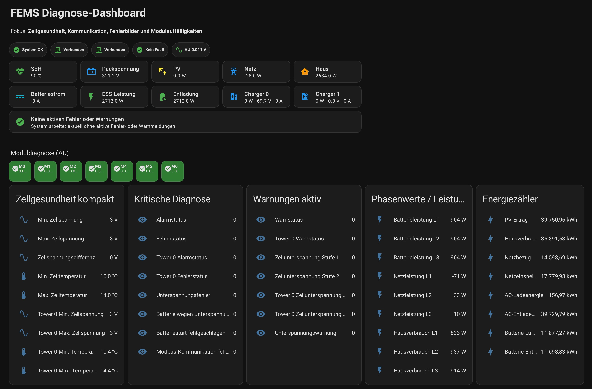
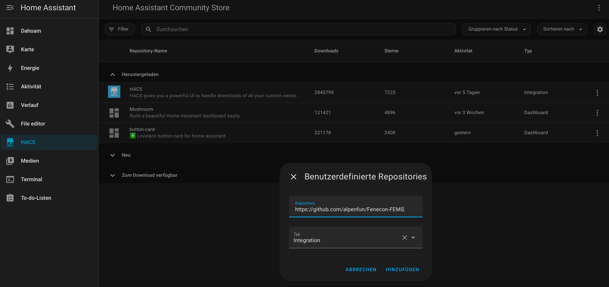
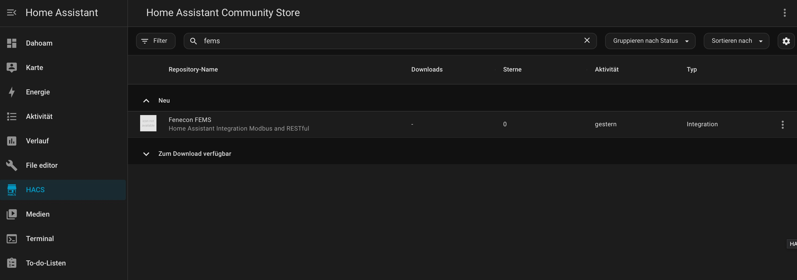
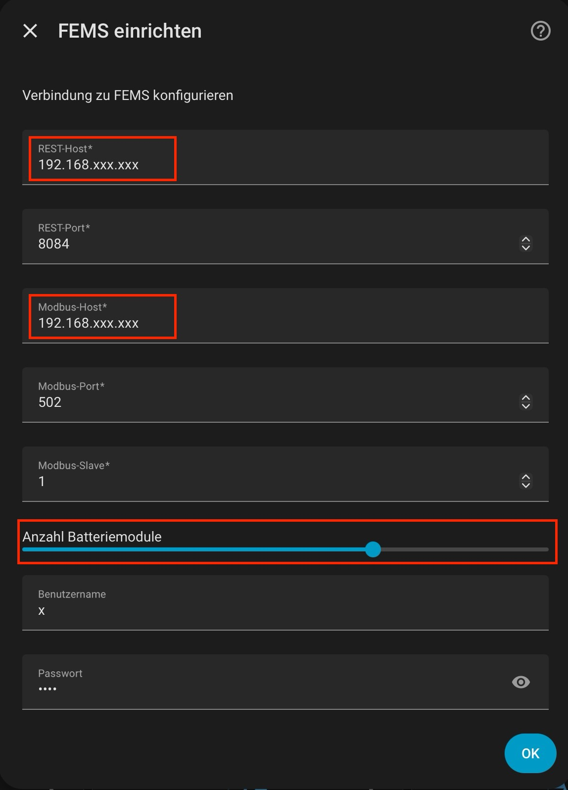

# 🔋 FEMS / Fenecon Integration für Home Assistant

Diese Integration ermöglicht die vollständige Einbindung eines **FENECON FEMS Energiesystems** in Home Assistant.

Sie kombiniert:

* 🌐 REST API (System- & Statusdaten)
* 🔌 Modbus (technische Echtzeitwerte)

---

## ✨ Features

* 📡 REST + Modbus Integration
* 🔋 Batterie- & Zellüberwachung
* ⚡ Energieflüsse & Leistungsdaten
* 🚨 Fehler- und Warnanalyse
* 📊 Energiezähler (kWh)
* 🧠 Diagnose-Logik (OK / Warnung / Fehler)
* 🔧 Konfigurierbare Anzahl Batteriemodule

---

## 🧪 Diagnose-Fokus

Diese Integration ist **kein klassisches User-Dashboard**, sondern ein:

👉 **Diagnose- & Analyse-Tool**

Fokus auf:

* Zellgesundheit
* Spannungsabweichungen (ΔU)
* Fehlerbilder
* Kommunikationsstatus

---

## 🖼️ Dashboard (Beispiel)



👉 Ein fertiges Dashboard liegt im Repository:

📄 

---

## 🎯 Designentscheidung

👉 **Einzelzellwerte sind bewusst NICHT im Dashboard enthalten**

Warum?

* Zu viele Daten
* Keine schnelle Diagnose möglich

Stattdessen:

* ΔU (Spannungsdifferenz)
* Min / Max Werte

👉 Einzelzellen sind weiterhin als Sensoren verfügbar!

---

## 🟢 Statuslogik

| Zustand | Bedeutung |
| ------- | --------- |
| 🟢 Grün | System OK |
| 🟡 Gelb | Warnungen |
| 🔴 Rot  | Fehler    |

---

## 🔋 Moduldiagnose (ΔU)

| ΔU            | Bewertung     |
| ------------- | ------------- |
| < 0.02 V      | 🟢 unkritisch |
| 0.02 – 0.05 V | 🟡 beobachten |
| > 0.05 V      | 🔴 kritisch   |

---

# 📦 Installation

## 1. HACS installieren (falls noch nicht vorhanden)

👉 https://hacs.xyz/

---

## 2. Repository hinzufügen



* HACS öffnen
* „Custom Repositories“
* URL einfügen:

```
https://github.com/alpenfun/Fenecon-FEMS
```

* Typ: **Integration**

---

## 3. Integration suchen & installieren



---

## 4. Integration konfigurieren



Benötigte Daten:

* REST Host (IP)
* REST Port (Standard: 8084)
* Modbus Host
* Modbus Port (502)
* Modbus Slave (meist 1)
* Anzahl Batteriemodule

---

# ⚙️ Geräte-Struktur

Die Integration legt folgende Geräte an:

* 🔋 Batterie
* ⚡ Charger 0
* ⚡ Charger 1
* 🧠 Diagnose
* 📊 Energiemanagement
* 🔬 Zellen

---

# 📊 Dashboard einrichten

## YAML importieren

Datei:

```
docs/dashboard/dashboard.yaml
```

👉 in Home Assistant:

* Dashboard → bearbeiten
* YAML Modus aktivieren
* Inhalt einfügen

---

## 🔧 Voraussetzungen (WICHTIG)

Dieses Dashboard nutzt Custom Cards:

### Pflicht:

* HACS
* 🍄 Mushroom Cards
* 🔘 Button Card (by RomRider)

Installation über HACS:

* „Mushroom“
* „button-card“

---

# ⚡ Hinweise

* Erststart kann 30–60 Sekunden dauern
* REST ist langsamer als Modbus
* Sensoren werden dynamisch erzeugt

---

# 🛠️ Entwicklung

Status:
👉 aktiv

Geplant:

* automatische Modulerkennung
* erweiterte Diagnose
* Health Score

---

# 🤝 Mitwirken

Feedback & Pull Requests willkommen!

---

# 📜 Lizenz

MIT License
