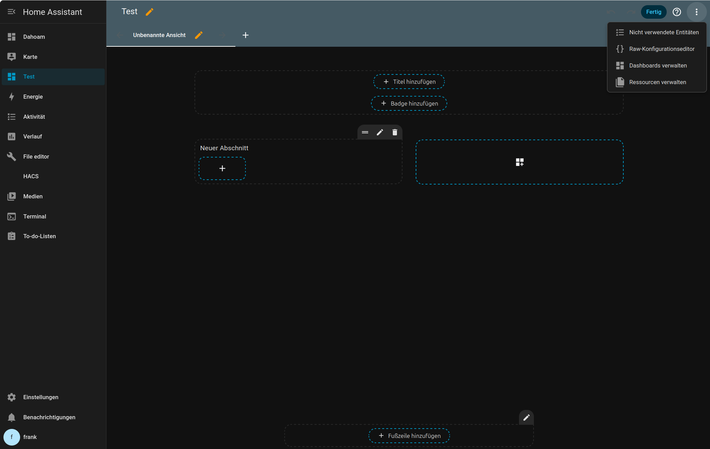
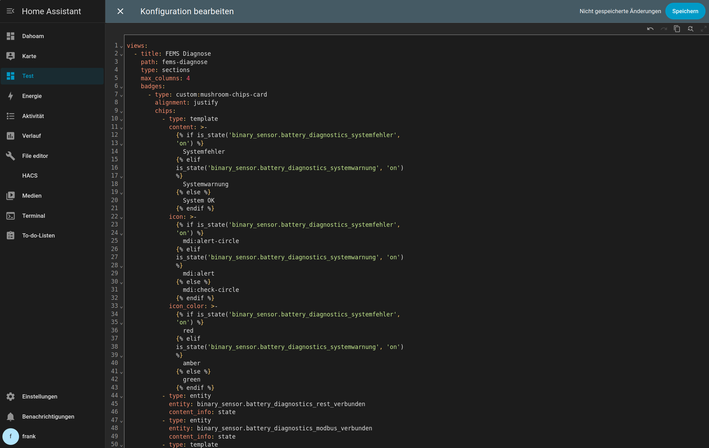
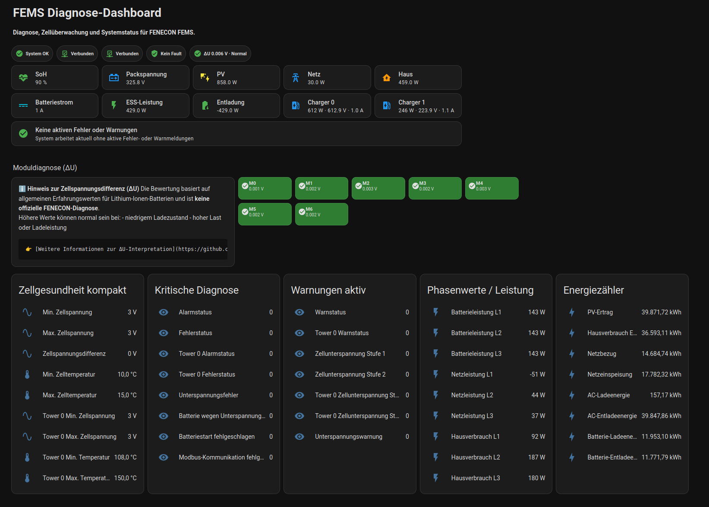

<p align="center">
  
</p>

---

# Dashboard Setup and Customization Guide

This guide explains how to use and adapt the example dashboard included in this repository.

## Prerequisites

Before using the example dashboard, make sure the following are installed:

- FEMS Diagnostics integration
- HACS
- Mushroom Cards
- button-card

The example dashboard file is located at:

```text
docs/dashboard.yaml
```

---

## 1. Import or copy the dashboard YAML

1. Open Home Assistant.
2. Open the dashboard you want to use.
3. Create a new view or edit an existing one.

<p align="center">
  
</p>

4. Switch to YAML mode if required.
5. Open the file `docs/dashboard.yaml` from this repository.
6. Copy the YAML content.

<p align="center">
  
</p>

7. Paste it into your dashboard or view configuration.
8. Save the dashboard.

<p align="center">
  
</p>

If the dashboard does not render correctly, first verify that all required custom cards (Mushroom Cards, button-card) are installed.

---

## 2. Adapt entity names

The example dashboard uses entity IDs from the development system.

Depending on your Home Assistant language, your naming history, or manual renaming, your entity IDs may differ.

Typical examples from the dashboard:

- `binary_sensor.battery_diagnostics_systemfehler`
- `binary_sensor.battery_diagnostics_systemwarnung`
- `sensor.battery_zellspannungsdifferenz`
- `sensor.cell_diagnostics_modul_0_du`

To adapt the dashboard:

1. Open Home Assistant.
2. Go to **Settings → Devices & Services → Entities**.
3. Search for the entity that matches the card function.
4. Copy your actual entity ID.
5. Replace the `entity:` value in the dashboard YAML.

In most cases, only the entity IDs need to be changed.  
The visible card labels can usually remain unchanged.

---

## 3. Adjust the dashboard to your battery configuration

The example dashboard currently includes module cards from `M0` to `M6`.

That means the example layout is based on a system with **7 battery modules**.

If your system has fewer modules, remove the unused module cards.

Examples:
- 3 modules → keep `M0` to `M2`
- 5 modules → keep `M0` to `M4`
- 7 modules → keep `M0` to `M6`

If the configured `battery_module_count` does not match the real system, some entities may be missing or unavailable.

---

## 4. Optional sensors and detail level

The example dashboard is intentionally designed as a compact diagnostics view.

Per-cell voltages are **not shown** in the default layout.

Why:
- too many entities for a compact dashboard
- harder to interpret at a glance
- module spread is usually the better first diagnostic indicator

If `enable_cell_voltages` is enabled, the additional cell voltage entities are available in Home Assistant and can be added manually to custom views.

If `enable_cell_voltages` is disabled, these detailed entities will not exist.

---

## 5. Recommended first customization steps

For a quick working setup:

1. Import the example dashboard YAML.
2. Replace entity IDs that differ in your system.
3. Remove unused module cards.
4. Save and test the dashboard.
5. Add more detailed cards later if needed.

## Example scenarios

### Small system

Use the dashboard with only a few module cards, for example `M0` to `M2`.

### Standard system

Use the dashboard almost unchanged and only adapt the entity IDs where necessary.

### Compact setup

Keep the standard dashboard as-is and do not add per-cell voltage cards.

## Troubleshooting

### Cards are shown as errors

Check whether the required custom cards are installed:
- Mushroom Cards
- button-card

### Entities are unavailable

Check whether:
- the integration is loaded correctly
- the entity IDs match your system
- the configured module count matches your real system

### Some module cards stay empty

Remove cards for battery modules that do not exist in your system.